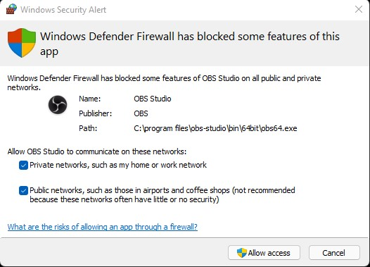

# ArduSub Companion Setup for exploreHD
## Streaming with ArduSub Companion
```{note} **As of November 20, 2021, all exploreHD/HDCam shipped will feature a new firmware that allows the cameras to be plug and play with ArduSub Companion without the need for drivers.**

If you notice the video stream is very sluggish, your exploreHD/HDCam may be running outdated firmware. Click [here](https://docs.exploredeepwater.com/software/firmware.html) to update the firmware.
```

## Streaming Multiple exploreHDs with ArduSub Companion
If you have multiple exploreHDs and you would like to stream them simultaneously, you can use the new [ArduSub Companion 1.0 BETA](https://docs.bluerobotics.com/ardusub-zola/software/companion/1.0/). 


```{note} When setting up the streams, make sure the udp:// is set to 192.168.2.1:560*

Change * to a number for different streams
```

## Receiving Multiple Streams
While there are multiple ways of viewing multiple streams, we will go over the simplest and most reliable methods in this documentation.

### QGroundControl
We are have developed a modified version of QGroundControl that can allow up to 3 cameras to be streamed at once. This is perfect if you are using ArduSub Companion.

To learn more, see our [modified version of QGroundControl](https://docs.exploredeepwater.com/software/qgroundcontrol.html). 

### OBS (Open Broadcaster Software)
To view the multiple streams in OBS, you will need to install OBS, GStreamer, and the OBS GStreamer plugin on your PC.

**Installing OBS**

[Click here to download the latest version of OBS](https://obsproject.com/download)

**Installing GStreamer**

To install GStreamer on Windows, check out the link below.

[Install GStreamer for Windows Instructions](/guides/pi_setup.html#step-10-install-gstreamer)

**Installing OBS Gstreamer Plugin**

Download the plugin [here](https://github.com/fzwoch/obs-gstreamer/releases/tag/v0.3.3).

Place the `obs-gstreamer.dll` in the `obs-plugins\64bit` folder of the root directory

In this example, it's `C:\Program Files\obs-studio\obs-plugins\64bit`

After this, you are done with the initial setup!

**Setting up the Stream in OBS**

After opening OBS, you want to add a GStreamer Source.


You should be prompted with a window like this


In the pipeline, use,

`udpsrc port=5600 ! application/x-rtp,media=(string)video,clock-rate=(int)90000,encoding-name=(string)H264 ! rtph264depay ! avdec_h264 output-corrupt=false ! videoconvert ! video. `

You will be prompted with the following window. Please enable OBS for both private and public networks.



After that, you should see a video stream! If you don't, make sure your port number is correct on both the receiving and streaming ends.

**To View Multiple Streams**

Add another GStreamer Source in the Sources Window


Use the same pipeline but change the port to what you set your streaming port to. In our example it's `5601`

`udpsrc port=5601 ! application/x-rtp,media=(string)video,clock-rate=(int)90000,encoding-name=(string)H264 ! rtph264depay ! avdec_h264 output-corrupt=false ! videoconvert ! video. `

Another stream should show up on the main window of OBS. Click on the video display to resize to your preference. 

Below is an example of a setup with viewing 3 exploreHDs at the same time using OBS!


**Recording/Streaming Settings**


Given each camera is set to 10Mb/s as the default bitrate, the streaming and recording should match that. In the case of 3 cameras, providing at least 30Mb/s of streaming and recording bitrate should provide you with high quality. 

**Limitation with this Setup**

With a 3 stream setup, this configuration will rely on a powerful GPU to run the videos smoothly. We found that OBS is a lot more intensive to run than QGround Control. Make sure your laptop is powerful enough to run it or you can lower the resolution of some of the streams to 720p.