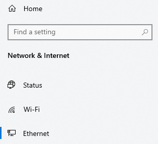

# PC Setup Guide

This is a guide for setting up a PC or laptop for use with a Raspberry Pi configured with {doc}`./pi_setup`.

## Configure Device Ethernet

This step is necessary to set the IP of your device in the local network provided by the Raspberry Pi over ethernet.

:::{dropdown} Windows
Under **Settings/Network & Ethernet**, select **Ethernet**



Under **Related Settings** on the right, select `Change Adapter Options`


Find the adapter named `Ethernet` with the subtitle of `Unidentified Network`


Right-click the adapter and select `Properties`


Locate `Internet Protocol Version 4 (TCP/IPv4)` and select `Properties`


Edit the menu to look like the following:


Click `OK` to apply changes. This should now allow you Pi to identify your Windows device under the correct ip address to stream data to.
:::

## Install GStreamer

```{note} This step is optional if using QGroundControl
```

::::{dropdown} Windows

Download the gstreamer framework from here: [http://gstreamer.freedesktop.org/data/pkg/windows](http://gstreamer.freedesktop.org/data/pkg/windows). **The recommended version is 1.18.1**.

Downloads:


* [Make sure to download the MinGW version of Gstreamer](https://gstreamer.freedesktop.org/download/)
```{important} Gstreamer would automatically install in the D drive if you have more than one drive on your PC. You can change it to the C drive when you do custom installation. 

If you install it on the D drive, just keep note of that when you set up your environment variables below.
```

**If in doubt of which install to use, download the 64-bit version, as this is more common.**

```{note} Make sure you update the PATH in Environment Variable after installing it on Windows.
```

:::{dropdown} Environment Variable Setup

1. Right-click the Windows icon in the taskbar and select **System**
2. Under **Related Settings**, select **Advanced System Settings**


3. Select **Environment Variables**


4. Highlight the variable **Path** by clicking on it and then click 'Edit...'

5. A new window should pop up and you want to click on `New` and add a path to your bin folder to the list. In this case, it's `C:\gstreamer\1.0\mingw_x86_64\bin` 


After that, click OK on both windows and you should be ready to go!

**To test the gstreamer setup, open CMD and run the following:**

    gst-launch-1.0 --version

This should result in an output similar to:

    gst-launch-1.0 version 1.16.2
    GStreamer 1.16.2
    https://launchpad.net/distros/ubuntu/+source/gstreamer1.0


:::

::::
