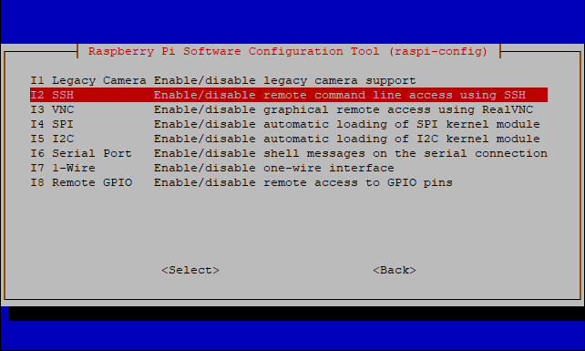
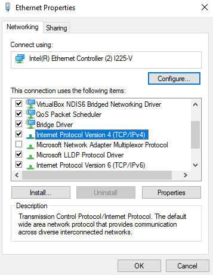

# Raspberry Pi Streaming Setup for exploreHD


```{note} The following instructions are for if you want to setup streaming from a Raspberry Pi without ArduSub. If you want plug-and-play compatibility we recommend following [this guide](https://www.ardusub.com/quick-start/installing-companion.html) to install ArduSub companion.


**These instructions are mostly for MATE ROV teams who wants the ability to stream multiple exploreHDs easily yet retain the ability to use their own flight controller!**
```

## Step 1: Flashing the Raspberry Pi

* Download and open the [Raspberry Pi Imager](https://www.raspberrypi.com/software/) from the official Raspberry Pi website
* If you haven't already, insert the SD card into your computer
* Select Raspberry Pi OS (32-bit) for the Operating System and the SD card you inserted as the SD card.
* Select `Write` to begin flashing the Operating System to the SD card

## Step 2: Powering

* Plug in a compatible HDMI cable and monitor to the Pi
* Connect a USB keyboard and mouse to the Pi
* Power the Pi using a micro usb or usb c power adapter depending on the version of Raspberry Pi you are using

```{important} Ensure you power the Pi after plugging the monitor in to the Pi **and wall power**, otherwise the Pi will not recognize the display and you will have to power cycle the device.
```

## Step 3: Perform the Initial Setup

* Setup the Pi with the GUI provided on start
* Ensure WiFi is connected as soon as possible

```{warning} Make sure you select the **US Keyboard layout** or some keys will not be recognized properly.
```

## Step 4: Set Static IP

* Edit dhcpcd.conf -  `sudo nano /etc/dhcpcd.conf`
* Add:
```
interface eth0
static ip_address=192.168.2.2/24
```
to the end of the file
* Save and close the file with `ctrl-o`, `enter`, and then `ctrl-x`

## Step 5: Connect to a Laptop

* Plug in an ethernet cable into the Raspberry Pi with the other end connected to a Windows or Linux laptop or PC
* Enable ssh on the pi

### Enabling SSH

Run `sudo raspi-config`


Select `Interface Options` and press enter


```{note} Use the arrow keys to navigate the menu up and down
```

Under `Interface Options`, Select `SSH`



Select `yes` and press enter


## Step 6: Reboot the Pi

Run: `sudo reboot`

## Step 7: Configure Laptop Ethernet

### Windows

Under Settings/Network & Ethernet, select Ethernet


Under Related Settings on the right, select `Change Adapter Options`


Find the adapter called `Ethernet` with the subtitle of `Unidentified Network`


Right click the adapter and select `Properties`


Locate `Internet Protocol Version 4 (TCP/IPv4)` and select `Properties`



Edit the menu to look like the following:


Click `OK` to apply changes. This should now allow you Pi to identify your Windows device under the correct ip address to stream data to.

## Step 8: SSH into the Pi

* From the connected Windows or Linux device, ssh into the Raspberry Pi

For Windows, we recommend using Putty which can be downloaded from [here](https://www.putty.org/)

* After installing, open Putty and type the address of the Raspberry Pi (192.168.2.2)


* Keep the other settings as default and click the `Open` button


* After connecting you will be prompted with a *security alert*. Ensure you select **accept**.


* To login use the following credentials: username: `pi`, password: `raspberry`


* You should be greeted with the following:


With Linux, you can use the builtin ssh client in terminal by running:
`ssh pi@192.168.2.2` with the same password as Windows (`raspberry`)

```{note} At this point you can disconnect the USB keyboard, mouse, and monitor from the Raspberry Pi.
```

## Step 9: Update the Pi

```
sudo apt-get update
sudo apt-get upgrade
sudo apt full-upgrade
sudo apt dist-upgrade
```

```{note} This process may take a while
```

## Step 10: Install GStreamer

### Windows Install

Download the gstreamer framework from here: [http://gstreamer.freedesktop.org/data/pkg/windows](http://gstreamer.freedesktop.org/data/pkg/windows). **Recommended version is 1.18.1**.

Downloads:

**32-bit:**
* [gstreamer-1.0-msvc-x86-1.18.1.msi](https://gstreamer.freedesktop.org/data/pkg/windows/1.18.1/msvc/gstreamer-1.0-msvc-x86-1.18.1.msi)

**64-bit:**
* [gstreamer-1.0-msvc-x86_64-1.18.1.msi](https://gstreamer.freedesktop.org/data/pkg/windows/1.18.1/msvc/gstreamer-1.0-msvc-x86_64-1.18.1.msi)
```{important} Gstreamer would automatically install in the D drive if you have more than one drive on your PC. You can change it to the C drive when you do custom installation. 

If you install it on the D drive, just keep note of that when you set up your environment variables below.
```

**If in doubt of which install to use, download the 64-bit version as this is more common.**

```{important}
**Make sure you update the PATH in Environment Variable after installing it on Windows.**

To do so, first find Environment Variables in the Start Menu by searching for it. Click on `Edit environment variables for your account`.


Highlight the variable `Path` by clicking on it and then click 'Edit...'

A new window should pop up and you want to click on `New` and add a path to your bin folder to the list. In this case, it's `C:\gstreamer\1.0\mingw_x86_64\bin` 


After that, click OK on both windows and you should be ready to go!

**To test the enviroment variables setup, open CMD and run `gst-launch-1.0` and you should get the following message**


```


### Linux Install

*a different installation method is recommended for a Raspberry Pi*

Use apt-get to install GStreamer 1.0:

`list=$(apt-cache --names-only search ^gstreamer1.0-* | awk '{ print $1 }' | sed -e /-doc/d | grep -v gstreamer1.0-hybris)`

`sudo apt-get install $list`

### Raspberry Pi Install

Remove GStreamer:

`sudo apt-get remove libgstreamer* gstreamer1.0*`

Install GStreamer:

`sudo apt-get install gstreamer1.0-tools gstreamer1.0-x gstreamer1.0-plugins-base gstreamer1.0-plugins-good gstreamer1.0-plugins-bad`

## Step 11: Plug in the Camera

* Connect an exploreHD or HDCam to an available USB port on the Raspberry Pi

```{note}
See {doc}`exploreHD <../products/explorehd>` or {doc}`HDCam <../products/hdcam>` getting started guides
```

## Step 12: Setting up the stream

### Finding the device
`v4l2-ctl --list-devices`


Look for device: **exploreHD USB Camera: exploreHD**
```{note}
In this example, we have 2 exploreHDs connected so it shows up twice. 
```
You can ignore `/dev/media*`

The different video numbers in each section represents the different encoding format. Typically the third one on the list is for H264 (in the above example video6 and video2 are H264 formats). Keep those in mind for the next step. The video number won't change as long as the USB device doesn't get unplugged even when you reboot the Pi. 
```{note}
If you are unsure the device number you selected is 'H264' format, you can run `v4l2-ctl --list-formats --device *` to find out. (replace * with the device number)
```
### Streaming in H264

On the Raspberry Pi, run:

`gst-launch-1.0 -v v4l2src device=/dev/video* ! video/x-h264, width=1920,height=1080! h264parse ! queue ! rtph264pay config-interval=10 pt=96 ! udpsink host=192.168.2.1 port=5600 sync=false`

```{note}
Replace the * in device=/dev/video* with the video device number seen in the previous step.
```

To stream more than one exploreHD at the same time, you can add an `&` to the code and run another one with the respective video device and port number.

You can make this command auto run to make your ROV camera streaming system!
### Receiving

To receive the stream on a Windows or Linux laptop or PC run:

`gst-launch-1.0 udpsrc port=5600 ! application/x-rtp ! rtpjitterbuffer ! rtph264depay ! avdec_h264 ! videoconvert ! autovideosink`

For more streaming options such as viewing multiple streams at once, please see

[Receiving Multiple Streams Instructions](/guides/ardusub_companion.html#receiving-multiple-streams)

