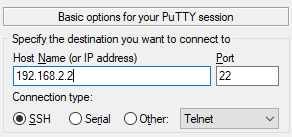
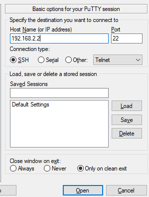

# SSH Into a Raspberry Pi

### Windows

For Windows, we recommend using Putty which can be downloaded from [here](https://www.putty.org/)

* After installing, open Putty and type the address of the Raspberry Pi (which should be set to 192.168.2.2 if you are following {doc}`Our Guide <./pi_setup>`)



* Keep the other settings as default and click the `Open` button



* After connecting you will be prompted with a *security alert*. Ensure you select **accept**.


* To log in, use the following credentials: username: `pi`, password: `raspberry`


* You should be greeted with the following:


### Linux and MacOS

First, open your terminal app.

```{note}
If using Linux, this will depend on your distribution. On MacOS, you can open spotlight and type: `Terminal`.
```

The general format for ssh on unix is:
`ssh -p port user@IP-Address`

Assuming a port of 22, a username of pi, and an ip address of 192.168.2.2:

```
ssh -p 22 pi@192.168.2.2
```

The password should default to `raspberry`.
