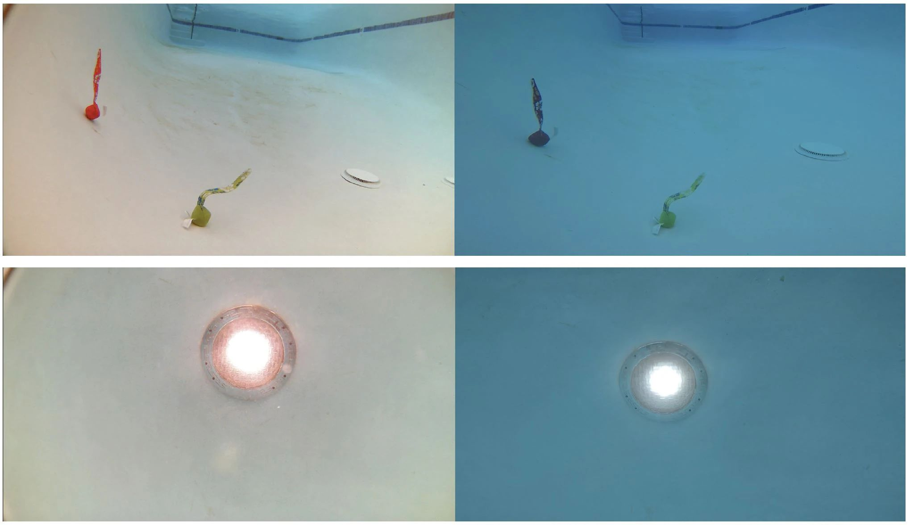
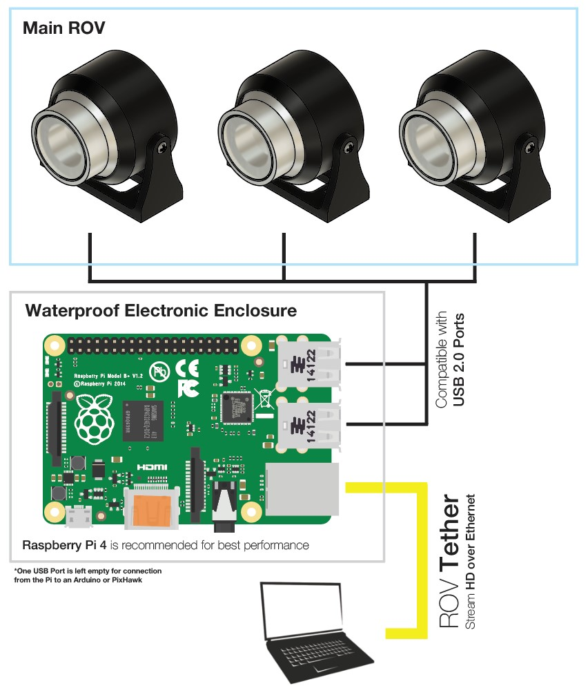

# exploreHD

[](https://exploredeepwater.com/products/explorehd-rov-auv-usb-camera)

[Product Link](https://exploredeepwater.com/products/explorehd-rov-auv-usb-camera)

## USS Midway Hull Inspection

```{youtube} chALMJ4gDEU
```

## {doc}`Firmware Update <../software/firmware>`

```{important} Please update your firmware if you were shipped an exploreHD or HDCam before 11/20/2021
```

## Introduction

Our passion for uncompromised image quality for marine robotics is the simple philosophy behind the exploreHD Underwater USB Camera (DWE-EHDUSBR2). This UVC compliant camera is the first of its kind to feature a high definition USB output while achieving a waterproof rating of IP69K. With the use of a modern Sony sensor, this camera will be able to see in low light conditions like never before. Thanks to advanced automated exposure and white balance adjustments, this camera produces accurate colors and a pleasing natural image. With H.264 compression technology, up to 7 cameras can be connected at once and streamed via ethernet without major quality loss or latency. This makes our camera the perfect choice for advanced multi-cam ROV/AUV setups.

## Technical Specifications

```{dropdown} Waterproof Specifications
**Waterproof Depth:** 400 meters 

**Ingress Protection Rating:** IP69K

**Cable Diameter:** 4mm OD
```

```{dropdown} Physical Specifications
**Mass in Air:** 84 grams

**Mass in Water:** 44 grams
```

```{dropdown} Camera Specifications
**Image Sensor:** 1/2.9" Sony Exmor™ CMOS 12-bit

**Resolution:** 1920x1080

**Framerate:** 30fps with H.264/MJPEG

**Format:** H.264, MJPEG, YUY2

**Chroma Subsampling:** 4:2:2 with YUY2, 4:2:0 with MJPEG/H.264

**Color Depth Per Channel:** 8 bit per RGB channel / 24 bit per pixel

**Bitrate:** 10Mb/s with H.264, VBR with MJPEG/YUY2 

**H.264 Compression Profiles:** Baseline Profile

**Streaming Latency:** 35ms ± 20 [More Details](#streaming-latency)

**Connection:** USB2.0 High Speed 

**Voltage:** 5V 

**Current:** 250mA

**Wattage:** <1.5W

```

```{dropdown} Lens Specifications
**Type:** Fisheye 

**Lens Aperture:** f/1.9

**View Angle:** 150 Degrees Diagonal (in water)

**Minimum Focus Distance:** 20-30 cm
```

## Image Samples

Color remains accurate even in low light situations


### Comparison of Color Accuracy with GoPro

The left Image is from exploreHD and the right is from a GoPro Hero


## Operating Notes

### Lens Field of View in Air vs Water

This lens has a fisheye effect which is more noticeable in the air than in the water due to the changes with light as it passes through different optical mediums. We took into account this factor and picked a lens that has a very wide field of view in the air so that when the lens is in the water, it can compensate for the lowered field of view. You may also notice a bit of vignetting when above water from the lens cap that will disappear in the water.

### TrueColor Technology

The camera offers TrueColor Technology which compensates for the blue/greenish tint in water using advanced AI white balance technology that we developed. However, to reduce the bluish/greenish tint, the camera has to compensate by adding more red/magenta. This means that in some images, the shadows may appear more red or magenta color. If you do not like this effect, you can turn off *auto white balance* in the exploreHD camera preferences.


## Camera Installation
```{youtube} 36yojUnr9V0
```

```{note} If the camera is going into an ROV electronic enclosure, you will need to waterproof the wires properly using a cable penetrator. You can either use potted penetrators or WetLink from Blue Robotics.

Recommended Cable Penetrators 

[**Potted Penetrators (M10 thread, for 3-4 mm cable)**](https://bluerobotics.com/store/cables-connectors/penetrators/penetrator-vp/)

[**WetLink Penetrator (WLP-M10-4.5MM-HC (for 4.0 mm cable)**](https://bluerobotics.com/store/cables-connectors/penetrators/wlp-vp/)
```

```{dropdown} Mount Installation
**Step 1**


Drill two holes, 30mm apart into your frame where you want the camera to reside. If using a thread-able material, tap an M3x0.5 thread. If using a non-thread-able material, ensure there is space for an M3x0.5 nut on the other side.

**Step 2**


Using two M3x0.5 screws, attach the camera bracket to the frame through the two holes on the base of the bracket.

**Step 3**


Place the standoff portion of the main camera body into the two remaining holes of the bracket. Now, you should have an axis about which the camera may rotate. 

Tighten the camera into place using the two M2x0.4 screws and the threaded portion of the standoffs.

**Step 4**


There may be some give on the rotation of the camera body. To ensure the camera is held in place, zip tie the camera usb cable to the ROV in such a manner that the tension of the cable keeps the camera in place. Ensure to make the zip tie as tight as possible without damaging the cable.
```

```{dropdown} Cable Waterproofing

**Step 1**


Ensure that the camera is mounted securely on the ROV as you like it with the previous steps

**Step 2**


Cut off the USB cable to the desired length. Ensure to leave extra length for when the cable is in the enclosure.

**Step 3**


Strip the cable to the length that will be in the electronic enclosure.

**Step 4**


Twist the section of wires that are stripped from the black rubber insulation

**Step 5**

Depending on the cable penetrator you are using, follow the instructions to waterproof the wires

```


````{dropdown} USB Connection

**Step 1**

<b>Before soldering the wires to the provided USB connector, please ensure the following tasks have been completed</b>

* Cable is properly waterproofed, following the steps in the previous page. 

* Cable penetrator has the o'ring in the o'ring groove. 

* Cable penetrator is on the outer portion of the electronic housing end cap.

* The wires have been passed through the nut for the cable penetrator. 

* The nut is on the inner portion of the electronic housing end cap.

**Step 2**

```{important} Ensure you are knowledgeable on the function of each wire.

<span style="color: black; font-weight:bold">Black: Ground</span>

<span style="color: #CCCC00; font-weight:bold">Yellow/Green: D+ (DP)</span>

<span style="color: gray; font-weight:bold">White: D- (DM)</span>

<span style="color: red; font-weight:bold" >Red: 5V</span>
```


```{warning} Ensure there are **no solder bridges and DOUBLE CHECK** to make sure the connection is correct. **The camera will get damaged if the polarity is not correct.**
```

```{admonition} Other Method of Installation Besides Soldering
 Although not our favorite method of connecting the exploreHD, if soldering becomes a challenge for you, we suggest using a USB to terminal block instead. This method is not as recommended because it takes up a lot more space in our electronic enclosure but if space isn't an issue, this method will work just fine. 

**Be extra careful to not mix up the polarity of the USB**

[USB Type A to Terminal Block](https://www.amazon.com/dp/B07VV7V7NC/ref=sspa_dk_detail_4?psc=1&pd_rd_i=B07VV7V7NC&pd_rd_w=eTGBR&pf_rd_p=887084a2-5c34-4113-a4f8-b7947847c308&pd_rd_wg=r5Sh6&pf_rd_r=V4YZ0K344EJ0W24PP5P5&pd_rd_r=c00159dd-c2be-46ac-8700-87874fd791f8&spLa=ZW5jcnlwdGVkUXVhbGlmaWVyPUEzVU4zMlAwRjkzVlkyJmVuY3J5cHRlZElkPUEwMTc5MjQwM0lYRFNESjlQNFJXWiZlbmNyeXB0ZWRBZElkPUEwOTc1ODgzMzlHV0lQSjRHSVFEVCZ3aWRnZXROYW1lPXNwX2RldGFpbCZhY3Rpb249Y2xpY2tSZWRpcmVjdCZkb05vdExvZ0NsaWNrPXRydWU=)
```

**Step 3**

Connect the USB cable to a computer to confirm the camera is working and in the correct orientation.


An image should be displayed using the built-in camera app on your computer. The device name should be exploreHD USB Camera

````

## Multi-Cam ROV Connection Diagram



## Streaming

```{dropdown} Streaming via custom Raspberry Pi
If you want to run your own custom streaming setup on the Raspberry Pi, we have the perfect documentation for you! 

This is perfect for MATE ROV teams who want to use the RPi to stream but don't want to be limited to PixHawk Controller from ArduSub Companion. It's also a great way to learn and customize your code for your specific setup!

{doc}`Raspberry Pi Streaming Setup for exploreHD Instructions <../guides/pi_setup>`
```

````{dropdown} Streaming alongside BlueOS Companion
```{important} **As of November 20, 2021, all exploreHD shipped will feature a new firmware that allows the cameras to be plug and play with BlueOS Companion without the need for drivers.**

If your camera was shipped beforehand or you notice the video stream is sluggish, you may be running an older version.

{doc}`Click Here for instructions on how to update <../software/firmware>`
```

If you want to stream multiple exploreHDs at once using BlueOS Companion, check out our {doc}`BlueOS Companion Guide <../guides/blueos_companion>` for installing our software alongisde BlueOS.
````

```{dropdown} H.264/Bitrate Control for Streaming
To set custom H.264 parameters when streaming from a Raspberry Pi or similar computer, install our {doc}`exploreHD Driver UI <../software/driverUI>`!

This software supports unlimited camera streams given you have unlimited USB ports, and installs perfectly alongside BlueOS.


- **Bitrate:** Adjust the bitrate of the exploreHD Camera
- **H.264:** Toggle H.264 on or off (Off is similar to MJPEG)
- **VBR:** Variable bitrate, changes bitrate depending on scene
- **UDP Stream:** Starts a UDP H.264 Stream via GStreamer with port 5600.

```

### Streaming Latency

- **Streaming Method:** UDP H.264 via Gstreamer
- **Streaming Device:** Raspberry Pi 4 Model B 2GB RAM
- **Streamed Devices:** 3 exploreHDs
- **Recieving Software:** Open Broadcaster Software
- **Latency:** 35ms ± 20

```{youtube} ZJl32Xt4jQQ
```

## Technical Drawings

```{dropdown} exploreHD 2.0 Housing

- [exploreHD 2.0 Assembly STEP File](https://cdn.shopify.com/s/files/1/0575/8785/9626/files/exploreHD_2.0_Full_Assembly_PUBLIC.step?v=1647568154)


```

```{dropdown} exploreHD 3.0 Housing

- [exploreHD 3.0 Assembly (Epoxy) STEP File](https://cdn.shopify.com/s/files/1/0575/8785/9626/files/eHD_3.0_with_Epoxy_STEP_Public.step)

- [exploreHD 3.0 Assembly (WetLink) STEP File](https://cdn.shopify.com/s/files/1/0575/8785/9626/files/eHD_3.0_with_WL_STEP_Public.step)

- [exploreHD 3.0 Stand Assembly STEP File](https://cdn.shopify.com/s/files/1/0575/8785/9626/files/eHD_3.0_Stand_Full_Assembly_v7.step)


```

