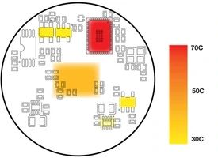
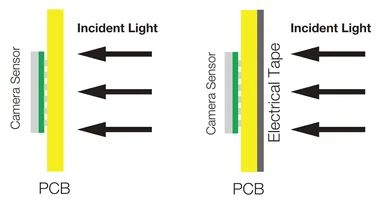
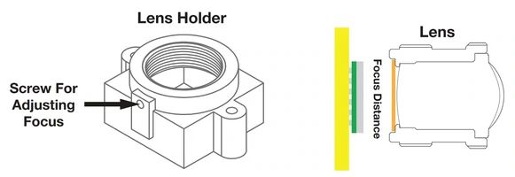
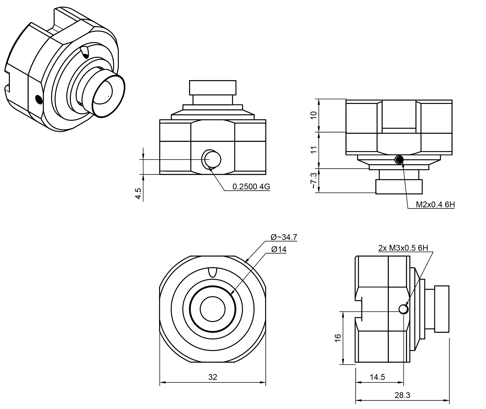
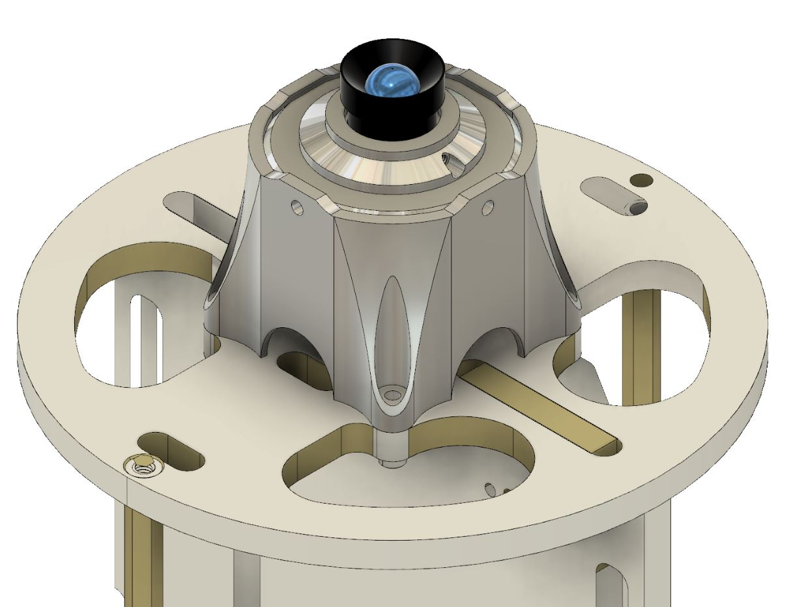

# HDcam

[](https://exploredeepwater.com/products/hd-usb-camera)

## {doc}`Firmware Update <../software/firmware>`

```{important} Please update your firmware if you were shipped an exploreHD or HDCam before 11/20/2021
```

## Introduction

The HDCam is the bare board of the exploreHD Camera but without the waterproof housing. This camera provides the same excellent image quality as the exploreHD but uses a specialized lens designed to be more suited for above water applications. The camera can output H.264, MPEG, and YUY2 at reduced frame-rates. Due to its low distortion and smooth frame-rate, this camera is ideal for computer vision applications.

```{note} This camera runs the same firmware as the exploreHD. The only optical difference between this camera and the exploreHD is the different lens used.

```

## Technical Specifications

```{dropdown} Camera Specifications
**Image Sensor:** 1/2.9" Sony Exmor™ CMOS 12-bit

**Resolution:** 1920x1080

**Framerate:** 30fps with H.264/MJPEG

**Format:** H.264, MJPEG, YUY2

**Chroma Subsampling:** 4:2:2 with YUY2, 4:2:0 with MJPEG/H.264

**Color Depth Per Channel:** 8 bit per RGB channel / 24 bit per pixel

**Bitrate:** 10Mb/s with H.264, VBR with MJPEG/YUY2 

**H.264 Compression Profiles:** Baseline Profile

**Streaming Latency:** 35ms ± 20 [More Details](#streaming-latency)

**Connection:** USB2.0 High Speed 

**Voltage:** 5V 

**Current:** 250mA

**Wattage:** <1.5W

**Footprint:** 30 mm diameter (PCB)
```

````{dropdown} Lens Specifications 
**Type:** Low Distortion Lens

**Lens Aperture:** f/2.8

**View Angle:** 100 Degrees Diagonal

**Minimum Focus Distance:** 15 cm

**Focal Length:**  2.7MM (19MM Equivalent on Full Frame)

```{note} We currently don't recommend this lens for underwater use due to its narrower aperture and vignetting qualities when the camera is underwater. For those looking to replace the standard ELP USB camera from BlueROV, we recommend using their lens for now until our team finds a more suitable lens for underwater.
```
````

## Operating Notes

### PCB Size Comparison


Size comparison of the PCB between the ELP's H.264 USB Camera (found in many current ROV systems) and the HDCam. 

HDCam features an advanced multilayer PCB and a much more modern image processor which allows our board to be more space efficient than the competition while providing better performance **(see below for comparison)**. 

### Image Comparison of HDCam vs ELP (Generic H.264 USB Camera)


### Temperature



For long-term operation, the camera may get hot (MAX Temp 70C). This is normal and not a cause for concern. The processor has an auto thermal shut off if it does exceed normal operating temperatures. If you
are designing a custom mount, it can not be manufactured with Polylactic acid (PLA) plastic as the heat from the camera will cause the plastic to weaken. Acrylonitrile butadiene styrene (ABS) is recommended instead.

### Sensor Affected by Incident Light



The Sony IMX323 sensor used in this camera is chosen for its smaller footprint while still providing great
image quality. Typically, CMOS sensors contain a ceramic plate on the back to prevent incident light from
entering through the back of the sensor causing an X-ray effect. The IMX323 sensor does not have a
ceramic plate and is therefore susceptible to indent light from the back of the camera affecting image quality. This can easily be avoided by using our included camera holder or using black electrical tape to cover
the back of the camera PCB.

### Lens Focusing



```{warning} Pay extra attention to not screw the lens past the sensor element. Doing so will crack the sensor and damage it permanently.

```

To ensure the sharpest image from your camera, the distance between the sensor and the lens must be set correctly. Before the camera leaves our facility, the focus is set manually and a screw is placed on the side of the lens holder to lock the distance. Sometimes, this screw can get loose over time and the camera loses proper focus. You can adjust this manually by taking the screw off and twisting the lens until the image is clear when viewing a far away distance on a computer.

**This will also allow users to use different M12 style lenses with the HDCam.**

```{note} If you are using a different lens than the one supplied, make sure it's compatible with the 1/2.9 sensor size. Using a lens designed for a larger sensor (1/2.8 or larger) will usually work but you will expect a lower FOV than advertised. Additionally, the lens will produce a less sharp image and artifacts such as chromatic aberration will be more noticeable. 

Conversely, using a lens designed for a smaller sensor (1/3 or smaller) will increase the FOV but you may notice more vignetting in the image. The lens will produce a sharper image and less chromatic aberration will be observed.

```

## Image Samples


## Streaming

```{dropdown} Streaming via custom Raspberry Pi
If you want to run your own custom streaming setup on the Raspberry Pi, we have the perfect documentation for you! 

This is perfect for MATE ROV teams who want to use the RPi to stream but don't want to be limited to PixHawk Controller from ArduSub Companion. It's also a great way to learn and customize your code for your specific setup!

{doc}`Raspberry Pi Streaming Setup for exploreHD Instructions <../guides/pi_setup>`
```

````{dropdown} Streaming alongside BlueOS Companion
```{important} **As of November 20, 2021, all exploreHD shipped will feature a new firmware that allows the cameras to be plug and play with BlueOS Companion without any extra drivers.**

If your camera was shipped beforehand or you notice the video stream is sluggish, you may be running an older version.

{doc}`Click Here for instructions on how to update <../software/firmware>`
```

If you want to stream multiple exploreHDs at once using BlueOS Companion, check out our {doc}`BlueOS Companion Guide <../guides/blueos_companion>` for installing our software alongside BlueOS.
````

```{dropdown} H.264/Bitrate Control for Streaming
To set custom H.264 parameters when streaming from a Raspberry Pi or similar computer, install {doc}`DWE OS <../software/dweos>`!

This software supports unlimited camera streams given you have unlimited USB ports, and installs perfectly alongside BlueOS.


- **Bitrate:** Adjust the bitrate of the exploreHD Camera
- **H.264:** Toggle H.264 on or off (Off is similar to MJPEG)
- **VBR:** Variable bitrate, changes bitrate depending on scene
- **UDP Stream:** Starts a UDP H.264 Stream via GStreamer with port 5600.

```

### Streaming Latency

- **Streaming Method:** UDP H.264 via GStreamer
- **Streaming Device:** Raspberry Pi 4 Model B 2GB RAM
- **Streamed Devices:** 3 exploreHDs
- **Receiving Software:** Open Broadcaster Software
- **Latency:** 35ms ± 20

```{youtube} ZJl32Xt4jQQ
```

## Technical Drawing



[Download STEP File of HDcam 2.0 Assembly](https://cdn.shopify.com/s/files/1/0575/8785/9626/files/HDC_Assy_v2.step?v=1661972385)



[Download STL File of HDcam 2.0 Mount for BlueROV 2](https://cdn.shopify.com/s/files/1/0575/8785/9626/files/BlueROV2_HDC_Bracket_v5_1.stl?v=1659117334)


