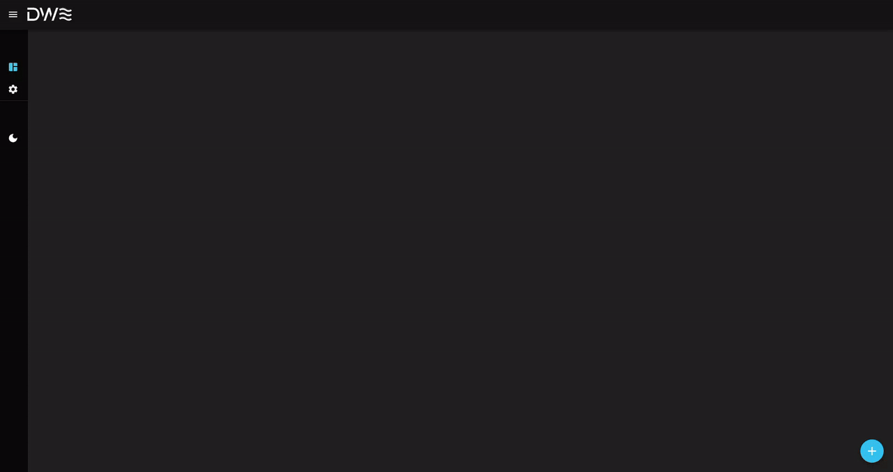
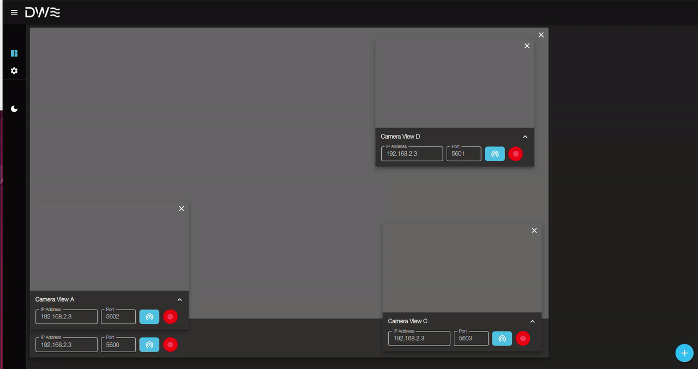
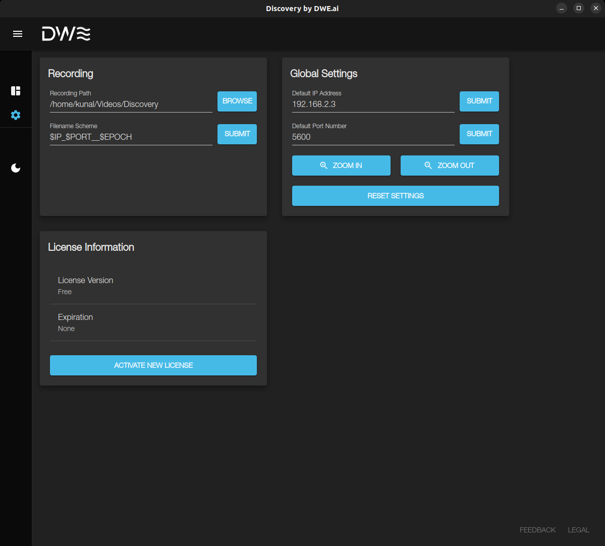
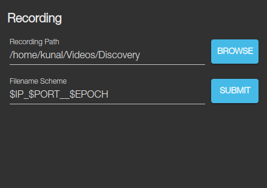
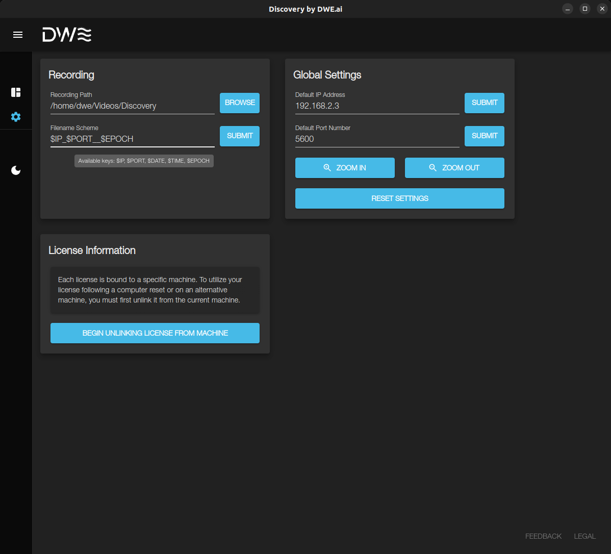
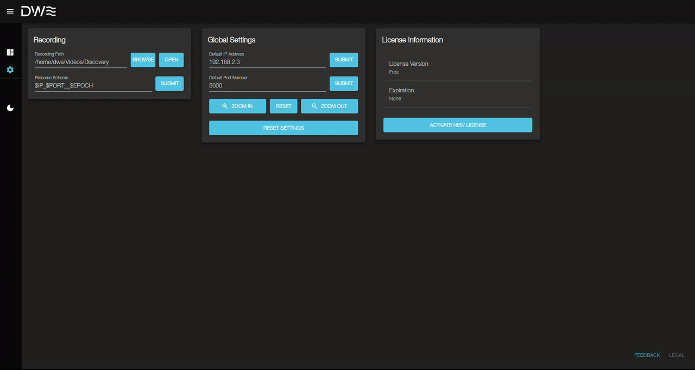
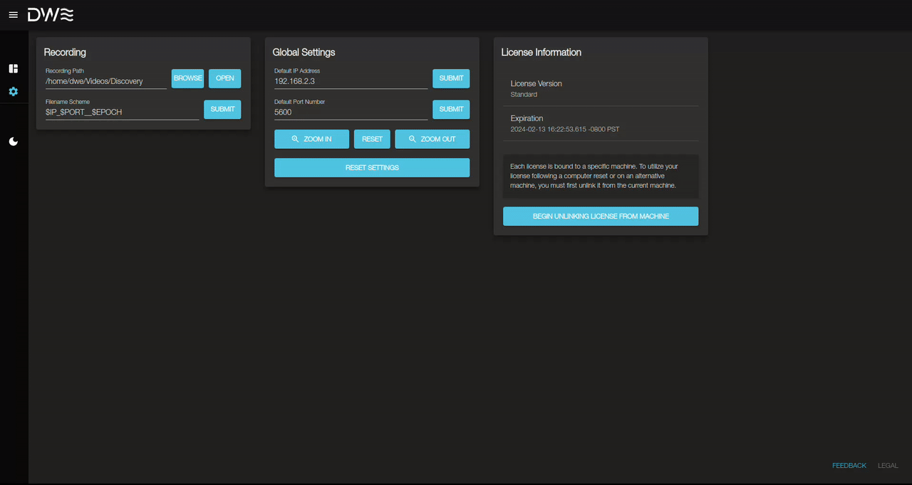

# Discovery for Desktop
To view the multiple streams in Discovery, all you will need to do is install Discovery! You can see the product page [here](https://dwe.ai/products/discovery).

```{important}
If you are plugging your Vehicle/Raspberry Pi/Other Device directly into your laptop via an ethernet cable/adapter/dongle, please see the [PC Network Setup Guide](../guides/pc_setup.md) first.
```

## Quickstart

Click the "Plus" Icon on the bottom-right side of the page. This will add a **"Video Card"**.



This page will contain your **"Cards"**. Each **card** will 2 input fields and 2 buttons. We will go over what each of these do.

## Quick Functions

### Stream All


### Stop All Active Streams


### Record All Active Streams


### Stop Recording All Active Streams


### Delete All Cards



## Video Card Buttons

### IP Address and Port

These fields specify the IP address and Port number that your camera is streaming too, usually called a stream endpoint. Usually this is your topside-computer's IPv4 address.

When there is no active video stream, the input fields will look like this and you will be able to modify these fields.


When there **is an** active video stream, the input fields will be greyed out. It will look like this and you will not be able to modify these fields, unless you stop the current video stream.


### Streaming Button

When there is no active video stream, the button will look like this and you will be able to click it to **start** the stream.


When there is an active video stream, the button will look like this and you will be able to click it to **end** the stream.


### Recording Button

When there is no active video stream, the button will look like this and you will not be able to click it.


When there is an active video stream **and** the video is **not** recording, the button will look like this and you will be to click it to **start** a recording.


When there is an active video stream **and** the video **is actively** recording, the button will look like this and you will be to click it to **end** a recording.


## Settings

Before we start streaming, however, it is recommended to change some settings to reflect your specific system.

Using the left-side navigation bar, you can head to the settings page by clicking the "gear"/settings icon.



Each card contains settings for various options in the software. 

### Recording Path

Here, you can change the output folder that all videos will save to. By default, the directory will be set to your system's "Videos" folder.



### Filename Scheme

Here, you can change the naming scheme for each saved recording. We recommend keep the default options. However, you are free to adjust the settings as you want. The following are "Keys" you can use in your filenames:

- `$IP` : The IP address of the camera you are going to be recording.
  - example: `192.168.2.1`
- `$PORT` : The Port number of the camera you are going to be recording.
  - example: `5600`
- `$DATE` : The current system date in the following format: `MM-DD-YYYY`
  - example: `09-07-2023`
- `$TIME` : The current system time in  24-HR format with the following formatting: `HHhMMmSSs`
  - example: `14h13m25s`
- `$EPOCH` : The UNIX based [epoch timestamp](https://www.epochconverter.com/)
-   example: `1695341103`



### Default IP Address and Port Number

This setting is used to set the default IP address input for each camera **card** you add.



Changing Default IP


Changing Default Port

### Activation

To activate your license for Discovery, click "Activate New License".

Enter your license key in the field labeled "License Key".

```{important} **Please ensure you have an active internet connection during activation.**
```


After a successful activation, you will see a success screen.

```{warning} If you ever plan on resetting your operating system or if you will no longer have your device in possession, **please unlink your license from the machine** to avoid any future troubles. [Click here for more information](#license-information-important).
```

### License Deactivation (Important)



Each license is bound to a specific machine. To utilize your license following a computer reset or on an alternative machine, you must first unlink it from the current machine.

If you own a multi-machine license, you don't need to unlink your license for each machine you add.

> For example, if you own a 3-Machine License, you can use your license key for up to 3 machines without needed to use the unlinking process.

> If you have 3-machines currently linked, you will need to unlink your license from a previous machine, in order to use Discovery on a different 4th machine.